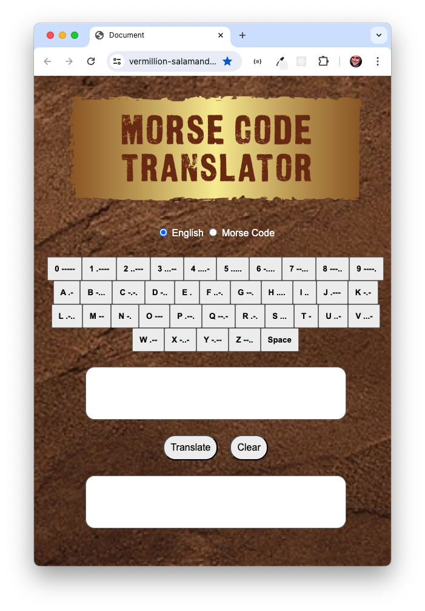

# Morse Code Translator

 

  

 
<b>Live deployment:</b> 
https://vermillion-salamander-bc6ac2.netlify.app/
 

## Outline

This project is a web based Morse Code translator. It achieves the following:

-    A user interface that allows the user to either input some English text or some Morse Code
-    JS functions that perform the following:

     -    Translates English text into Morse Code
     -    Morse Code into English text
